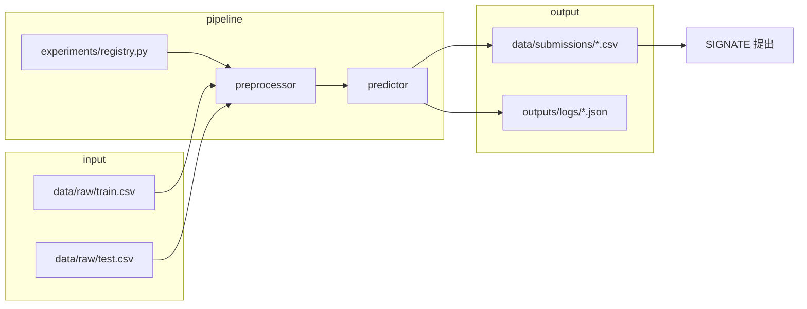

# SIGNATE 近赤外スペクトル分析チャレンジ（チーム用）

[SIGNATE「近赤外研究会 スペクトル分析チャレンジ」](https://user.signate.jp/) — **木材含水率予測（RMSE）** の共同開発リポジトリです。

リポジトリ: [github.com/Shintaisei/signate-nir-challenge](https://github.com/Shintaisei/signate-nir-challenge)

---

## 初回セットアップ（メンバー向け）

### 1. クローン

```bash
git clone https://github.com/Shintaisei/signate-nir-challenge.git
cd signate-nir-challenge
```

### 2. Python 環境

```bash
python3 -m venv .venv
source .venv/bin/activate   # Windows: .venv\Scripts\activate
pip install -r requirements.txt
```

### 3. SIGNATE 認証

```bash
cp config.example.py config.py
# config.py を開き、SIGNATE のメール・パスワードを記入（このファイルは git に含めない）

python scripts/setup_token.py
```

401 エラーが出たら `setup_token.py` を再実行してください。

### 4. コンペデータ取得

```bash
python scripts/download_competition_data.py
```

`data/raw/train.csv` と `data/raw/test.csv` が揃えば OK です。

### 5. 動作確認

```bash
python run.py --list
python run.py candidate_linear_1f --cv group_species
```

提出 CSV は `data/submissions/candidate_linear_1f.csv` に生成されます。

---

## キャッチアップの読む順

| 順 | ドキュメント | 内容 |
|----|-------------|------|
| 1 | 本 README | セットアップ・日常コマンド |
| 2 | [docs/TEAM_ONBOARDING.md](docs/TEAM_ONBOARDING.md) | 構成図・データフロー・用語 |
| 3 | **[docs/RETROSPECTIVE_2026-05-30.md](docs/RETROSPECTIVE_2026-05-30.md)** | **データの性質・振り返り・戦略の種（必読）** |
| 4 | [docs/NEXT_ACTIONS.md](docs/NEXT_ACTIONS.md) | いまの方針・Public 実績 |
| 5 | [docs/EDA_REPORT.md](docs/EDA_REPORT.md) | EDA 数値詳細 |
| 6 | [docs/STRATEGY_V2.md](docs/STRATEGY_V2.md) | 仮説・評価プロトコル |

---

## フォルダ構成

```
signate-nir-challenge/
├── run.py                      # メイン CLI（実験実行・提出・ランキング）
├── config.example.py           # 認証テンプレ（→ config.py にコピー）
├── requirements.txt
│
├── scripts/
│   ├── setup_token.py          # SIGNATE トークン取得
│   ├── download_competition_data.py
│   ├── phase_gate_check.py     # 提出前ゲート一括判定
│   └── migrate_paths.py        # 旧パス移行用
│
├── src/
│   ├── experiments/
│   │   └── registry.py         # ★ 実験名 → 前処理 + モデル の定義
│   ├── pipeline/
│   │   ├── runner.py           # 学習・CV・提出の実行本体
│   │   ├── data.py             # train/test 読込
│   │   ├── cv.py               # CV 分割（group_species 等）
│   │   ├── preprocessors/      # spectral, snv, blend_snv25 等
│   │   ├── models/             # 予測器（single_feature_linear 等）
│   │   ├── public_score.py     # Public 記録・比較
│   │   └── signate_submit.py   # API 提出
│   └── eda/                      # 分析スクリプト（提出なし）
│
├── data/
│   ├── raw/                    # train.csv, test.csv（git 外・各自 DL）
│   ├── submissions/            # 提出 CSV（git 外）
│   └── processed/
│
├── outputs/                    # logs, leaderboard（git 外・各自生成）
├── meta/                       # コンペメタ情報
└── docs/                       # 調査・方針・EDA レポート
```

### 処理の流れ



**新しい実験を足すとき**: `src/experiments/registry.py` に1行追加するだけで、`run.py <実験名>` が使えます。

---

## 日常コマンド

```bash
source .venv/bin/activate

# 実験一覧
python run.py --list

# 学習 + CV + 提出 CSV 生成
python run.py candidate_linear_1f --cv group_species
python run.py candidate_linear_1f --cv moisture_quantile

# 提出候補 5 枠プラン
python run.py --top5

# 提出前ゲート（public_diff / moisture_cv）
python scripts/phase_gate_check.py --phase prep

# SIGNATE 提出
python run.py candidate_linear_1f --submit --memo "説明"

# Public スコア記録（提出後）
python run.py --record-public candidate_linear_1f 17.496
```

---

## チーム運用ルール

| 項目 | ルール |
|------|--------|
| **コミットする** | コード、`docs/`、`meta/` |
| **コミットしない** | `config.py`、`.venv/`、`data/raw/*.csv`、`outputs/`、`data/submissions/*.csv` |
| **Public ベスト** | `candidate_linear_1f` → **17.496** |
| **Private 選択** | `candidate_linear_1f.csv` を必ず含める |
| **探索提出** | 週 1 本まで。ゲート通過 + 根拠あり |
| **Public 記録** | 提出者が `--record-public` で共有 |

### Public 実績（2026-05-29 時点）

| 実験 | Public | 備考 |
|------|--------|------|
| **`candidate_linear_1f`** | **17.496** | ベスト・Private 必須 |
| `candidate_linear_1f_blend_snv25` | 18.558 | 2 番手（前処理探索） |
| `group_curve_blend_snv_diff1` | 21.17 | Private 保険候補 |
| snv_diff1 系 | ~25 | LOO は良いが Public 悪化 |

詳細: [docs/NEXT_ACTIONS.md](docs/NEXT_ACTIONS.md)

---

## コンペ情報

| 項目 | 値 |
|------|-----|
| 課題 | 近赤外スペクトル → 木材含水率 |
| 評価 | RMSE（低いほど良い） |
| train | 1322 行・18 樹種 |
| test | 550 行・6 樹種（**train と樹種非重複**） |
| CSV エンコーディング | `cp932` |

---

## 困ったとき

- **401 / 提出失敗** → `python scripts/setup_token.py`
- **データがない** → `python scripts/download_competition_data.py`
- **実験名が不明** → `python run.py --list`
- **方針がわからない** → [docs/NEXT_ACTIONS.md](docs/NEXT_ACTIONS.md)
