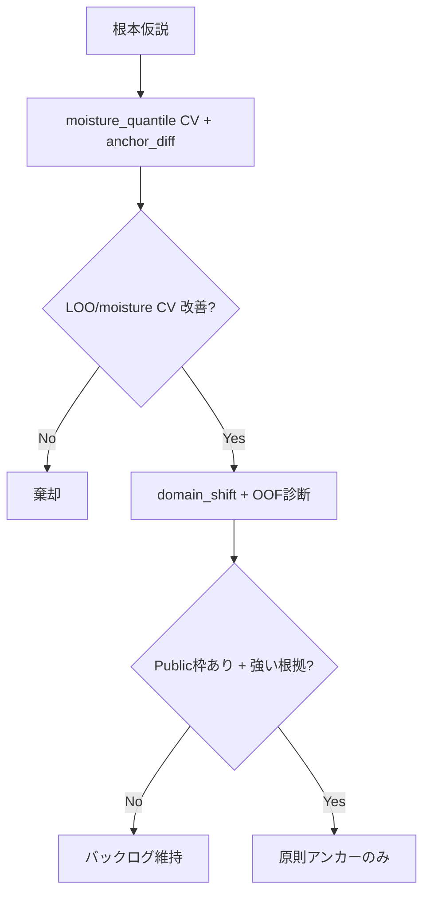

# 根本改善リサーチ（ブレンド以外）

## 問題の本質

| 事実 | 意味 |
|------|------|
| train 13樹種 / test 6樹種、**名前の重複ゼロ** | 樹種LOOは「未見樹種」だが、スペクトル分布は別問題 |
| **Public ベスト** = `candidate_linear_1f`（raw 1波長）**17.496** | snv_diff1 は LOO 良いが Public ~25 |
| LOO↓でも Public↑（blend, 2f） | **ローカル指標が目的関数と一致していない** |

ブレンド・clip・波長微変更は「出力の摂動」に留まる。  
根本改善は **(A) 評価を直す** と **(B) test ドメインへの知識の渡し方を変える** の2軸。

---

## トラックA: 評価の刷新（提出なし）

### A1. 含水率層化 CV `moisture_quantile`

```bash
python run.py candidate_linear_1f_snv_diff1 --cv moisture_quantile
```

樹種ではなく **含水率の外挿** をローカルで罰する。Public との相関が LOO より上がるか検証する。

### A2. ドメインシフトレポート

```bash
python src/eda/domain_shift_analysis.py
# -> outputs/logs/domain_shift_report.json
```

test 各樹種の「スペクトル的に最も近い train 樹種」と、アンカー予測のレンジバイアスを確認。

### A3. アンカー OOF 診断

```bash
python run.py candidate_linear_1f_snv_diff1 --cv leave_one_species
python src/eda/analyze_oof.py candidate_linear_1f_snv_diff1 --cv leave_one_species
```

樹種別・含水率ビン別の **range_gap / bias** を見る（提出判断には使わない）。

---

## トラックB: モデル仮説（ローカル検証のみ）

| ID | 実験 | 仮説 | コマンド |
|----|------|------|----------|
| B1 | `candidate_linear_1f_nearest_train_species_snv_diff1` | test樹種→スペクトル最近傍train樹種→その樹種で学習した1波長 | **ローカル棄却**（moisture CV RMSE≈120） |
| B2 | （未実装）含水率ビン別の波長 | 高含水/低含水で波長が違う可能性 | domain_shift_report 後 |
| B3 | （未実装）PCA1 + 線形 | 1波長より低次元で安定？ | 過去PLSはPublic悪化のため優先度低 |

**提出ゲート**: Public 実測でベスト更新があるまで **アンカーのみ提出**。

---

## 判断フロー（研究用）



---

## 停止した方向（実測済み）

- ブレンド（raw 2% → Public 24.6）
- 2波長 Ridge（24.5）
- clip / lowtail
- Group curve / TopK 系

---

## 初回分析メモ（2026-05-29）

- test 6樹種のうち **4樹種が train「クリ」に最近傍**（cos 0.97〜0.99）
- アンカー test 予測は **std が train より小さい**（0.80倍）→ レンジ圧縮の可能性
- `moisture_quantile` CV: アンカー RMSE **21.1**（LOO 18.7 より悪いが Public との相関は要検証）
- 最近傍train樹種モデルは **大幅悪化** → 樹種単位の別波長をそのまま適用する路線は不採用

## 成果物

| ファイル | 内容 |
|----------|------|
| `outputs/logs/domain_shift_report.json` | スペクトルNN・仮説リスト |
| `outputs/logs/*_oof_analysis.json` | 樹種/ビン別誤差 |
| `leaderboard.csv` | `moisture_quantile` 列を追加して比較 |
