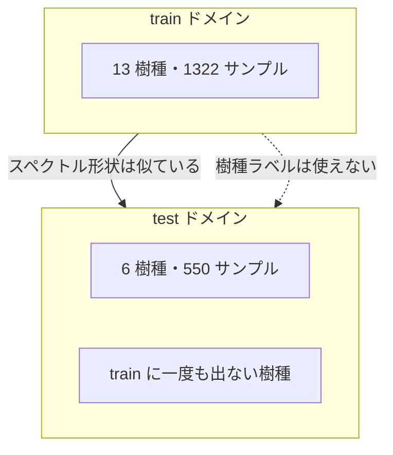
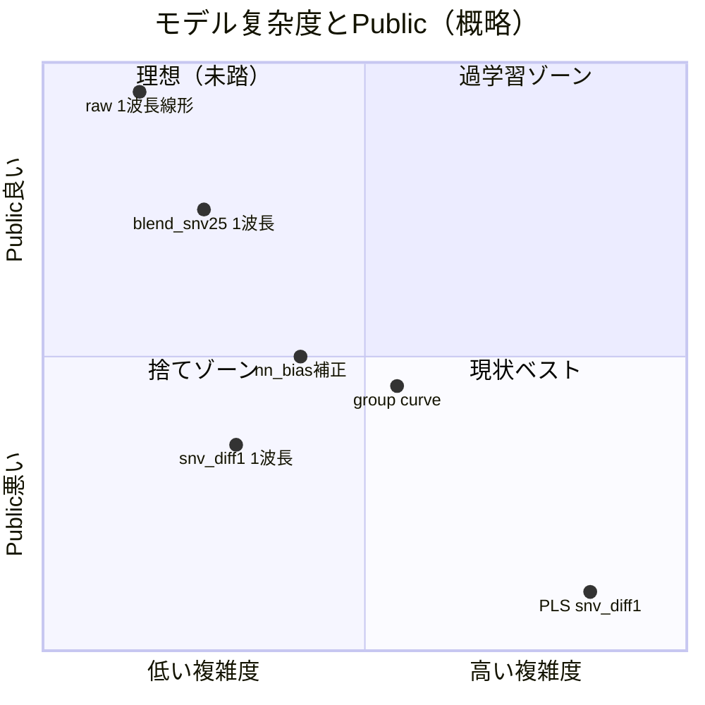

# 振り返りと戦略の種（〜2026-05-30）

> **目的**: 5/30 時点までの実験結果を、**データの性質**から順に整理し、「何を信じて次に進むか」をチーム全員が共有できるようにする。
>
> 関連: [EDA_REPORT.md](EDA_REPORT.md) / [STRATEGY_V2.md](STRATEGY_V2.md) / [NEXT_ACTIONS.md](NEXT_ACTIONS.md)

---

## 目次

1. [データの性質（ここから読む）](#1-データの性質ここから読む)
2. [コンペの構造と難しさ](#2-コンペの構造と難しさ)
3. [5/30 までの結果振り返り](#3-530-までの結果振り返り)
4. [前処理：何が効いて何が効かないか](#4-前処理何が効いて何が効かないか)
5. [モデル：何が良さそうか](#5-モデル何が良さそうか)
6. [評価指標：何を信じるか](#6-評価指標何を信じるか)
7. [今後の戦略の種](#7-今後の戦略の種)

---

## 1. データの性質（ここから読む）

### 1.1 何を予測しているか

| 項目 | 内容 |
|------|------|
| **入力** | 木材の近赤外（NIR）スペクトル **1555 波長**（約 9994〜4000 nm） |
| **出力** | **含水率（%）** — 連続値回帰 |
| **評価** | RMSE（低いほど良い） |
| **train** | 1322 行・**13 樹種** |
| **test** | 550 行・**6 樹種** |

メタ列（樹種名、`species number`、`sample number` 等）もあるが、**test には正解ラベル（含水率）が無い**。

### 1.2 含水率ラベルの分布

train 全体（`outputs/logs/data_profile.json`）:

| 統計量 | 値 |
|--------|-----|
| min | 0.84 % |
| median | **29.1 %** |
| mean | 49.9 % |
| max | 298.6 % |
| std | 49.5 % |

**右に長い裾を持つ分布**（低含水〜中含水が多く、高含水の外れ値も存在）。  
「平均含水率で予測する」だけでも RMSE ~40 台になり、ベスト Public **17.5** との差は大きい。

### 1.3 樹種 — このコンペ最大の特徴

```
train 樹種（13）: イチョウ, ウエンジ, ウォールナット, クリ, スプルース, チェリー,
                  トチ, ナラ, ヒノキ, ベイスギ, 米ヒバ, ベイマツ, ホワイトオーク

test 樹種（6）:  クスノキ, ケヤキ, スギ, タモ, チーク, ヤマザクラ

→ 樹種名の overlap = 0（完全非重複）
```



**重要**: 通常の chemometrics（同一樹種の校正 → 同樹種の予測）とは前提が違う。  
**「見た目似たスペクトルでも、樹種が違うと含水率の付き方が違う」** 問題。

### 1.4 樹種ごとの含水率は大きく異なる

train 内だけでも mean が **15%（ウエンジ）〜 88%（ベイスギ）** と幅がある。

| 樹種 | 件数 | mean 含水率 | std |
|------|------|------------|-----|
| ウエンジ | 87 | 15.5 | 12.3 |
| トチ | 183 | 31.6 | 29.2 |
| ナラ | 107 | 41.8 | 25.6 |
| ヒノキ | 141 | 39.6 | 53.0 |
| ベイスギ | 112 | **88.3** | 80.0 |
| 米ヒバ | 68 | 70.1 | 46.3 |

test 側はラベルが無いが、**樹種 ID が使えない**ので「樹種ごとに別モデル」はそのままでは使えない。

### 1.5 スペクトルの性質

1. **1555 次元の連続スペクトル** — 波長間に強い相関（隣接波長はほぼ同じ情報）
2. **raw 1f モデルが選ぶ波長** — index **616** 付近（|corr|≈0.78）。周辺 610〜626 も同程度に相関が高い → **狭い帯域に情報が集中**
3. **SNV+diff1 だと別バンド** — index **1350**（|corr|≈0.91 on train）。**734 波長離れている**
4. **test ↔ train 最近傍樹種のコサイン類似度** — 0.996〜0.999（形状は非常に似ている）
5. **それでも予測はズレる** — 形状が似ていても、含水率の写像は樹種で違う

### 1.6 データの性質を一文で

> **「スペクトルの見た目（形状）は train/test で近いが、樹種が非重複なので、同じ吸光度から含水率を読むルールが test では通用しない。過学習しやすく、train 相関の高い特徴ほど Public で崩れやすい。」**

---

## 2. コンペの構造と難しさ

### 2.1 問題のタイプ

| 観点 | このコンペ |
|------|-----------|
| 機械学習の分類 | **ドメインシフト付き回帰** |
| 典型 NIR 論文 | 同一材種・同一計測条件での校正 |
| 本コンペ | train/test **樹種完全非重複** |
| 結果 | 文献標準（PLS+SNV）が **Public で大敗** |

### 2.7 ベストモデルの失敗モード（EDA）

`candidate_linear_1f` の test 予測を樹種別に見ると:

| test 樹種 | 最近傍 train | 判定 |
|-----------|-------------|------|
| スギ, チーク | ヒノキ | **レンジ圧縮**（std ≈ 0.5×） |
| ケヤキ, クスノキ | スプルース / 米ヒバ | **レンジ圧縮** |
| タモ, ヤマザクラ | ナラ | **レンジ拡大**（std ≈ 1.6×） |

Public **17.5** は「全体として当たっている」が、**樹種ごとには mean/std のズレがある**状態。  
改善の焦点は **「特徴量を増やすこと」より「予測分布の補正」** に寄っている。

### 2.3 train OOF で見える弱点

樹種 × 含水率 4 分位の RMSE マトリクス（1f）:

| 樹種 | 含水率帯 | RMSE | bias |
|------|---------|------|------|
| ベイスギ | 高含水 | ~120 | +116 |
| ホワイトオーク | 高含水 | ~59 | -52 |

**高含水域・特定樹種で大きく外れる** — ただし test 最近傍樹種と train 外れ樹種の bias パターンは **1:1 では対応しない**。

---

## 3. 5/30 までの結果振り返り

### 3.1 タイムライン

| 日付 | やったこと | 結果 |
|------|-----------|------|
| **5/27** | 初回 Public 提出（PLS, 1f, snv_diff1） | **1f = 17.496 がベスト**確定 |
| **5/28** | snv 系 clip/blend、group curve、diff1 等 | すべて **17.5 超**（21〜25 台） |
| **5/29 AM** | 2f_stable、1f 2% blend、snv 再提出 | 24〜25 台 — 複雑化は悪化 |
| **5/29 PM** | 1f 再提出 | **17.496 再現** |
| **5/29 夜** | EDA スプリント、H-A/B/C 実装、前処理チューニング | ローカル改善多数、Public 未確認 |
| **5/29 夜** | `blend_snv25` 5 本目提出 | Public **18.558**（2 番手・1f より +1.06） |

### 3.2 Public 実測一覧（重要度順）

| Public | 実験 | 前処理 | モデル | 示唆 |
|--------|------|--------|--------|------|
| **17.496** | `candidate_linear_1f` | **raw** | 単波長線形 | **ベスト・再現済み** |
| **18.558** | `candidate_linear_1f_blend_snv25` | raw 75% + SNV 25% | 単波長線形 | 2 番手。前処理微調整の上限感 |
| 21.17 | `group_curve_blend_snv_diff1` | snv_diff1 + meta | group curve | Private 保険程度 |
| ~23–25 | snv_diff1 / blend / 2f / diff1 系 | SNV 系 | 線形〜Ridge | **train 相関↑ ≠ Public↑** |
| 35.7 | `pls_snv_diff1_c8` | SNV+diff | PLS | 文献標準が最悪クラス |

### 3.3 ローカルだけ良かったもの（罠）

| 実験 | group_species | moisture_cv | public_diff | Public |
|------|---------------|-------------|-------------|--------|
| `nn_bias` | **28.44** | **25.93** | 8.41 | **未提出** |
| `blend_snv25_nn_bias` | **30.79** | **23.79** | 10.18 | **未提出** |
| `1f_snv_diff1` | 20.75 | 21.11 | — | **24.95** |

**LOO / group_species / moisture_cv が良い ≠ Public が良い** ケースが繰り返し発生。

### 3.4 5/30 時点の結論

1. **Public ベストは raw 単波長（1f）で固定**
2. **SNV 全開・PLS・多変量は Public で勝てていない**
3. **前処理の軽微な調整（blend_snv25）だけが 1f を僅かに超えられない 2 番手**
4. **補正系（nn_bias 等）はローカル最良だが Public 実測なし → リスク高**

---

## 4. 前処理：何が効いて何が効かないか

### 4.1 前処理の役割（このデータで）

通常の NIR 前処理の目的:

| 目的 | このコンペでの relevance |
|------|-------------------------|
| 散乱補正（SNV, MSC） | 計測条件差の除去 — **test ドメインでは波長選択を狂わせた** |
| 微分（diff1） | ベースライン除去 — **Public 25 台** |
| 平滑化 | ノイズ除去 — **1f とほぼ同一**（smooth3/5） |
| raw | そのまま — **Public ベスト** |

### 4.2 実測結果マトリクス

| 前処理 | Public 実測 / 推定 | moisture_cv | 判定 |
|--------|-------------------|-------------|------|
| **raw (`spectral`)** | **17.496** | 31.05 | **採用** |
| blend_snv25（raw 75% + SNV 25%） | **18.558** | 29.92 | 準採用（2 番手） |
| smooth3/5 | ≈1f 同一 | ≈31.05 | 変化なし |
| MSC | 未計測（local 悪化） | 28.36 | 棄却 |
| area / detrend | 未計測（local 悪化） | 37+ / 29+ | 棄却 |
| center / l2norm | 未計測 | 31+ / 36+ | 棄却 |
| **SNV / SNV+diff1** | **~25** | ~21 | **棄却** |

### 4.3 なぜ SNV が train では良く見えて Public で崩れるか

```
train:  SNV+diff → 波長 1350、|corr|=0.91  ← LOO RMSE ~18.7 と良い
test:   同じ波長・同じ slope では外れ樹種の写像が合わない → Public ~25
raw:    波長 616、|corr|=0.78              ← LOO は悪いが Public 17.5
```

**train 上の相関最大化 ≠ test 上の RMSE 最小化**  
SNV は train 内の線形関係を「綺麗に」するが、**選ばれる波長バンド自体が test 向きではない**。

### 4.4 前処理の指針（5/30 時点）

| 方針 | 内容 |
|------|------|
| **基本** | **raw を維持** |
| **試すなら** | SNV を **25% 以下**に抑えたブレンド程度 |
| **避ける** | SNV+diff 単体、MSC/area/detrend による波長変更、強い正規化 |
| **文献との差** | 論文は「同一材種校正」→ SNV+PLS が正解。**本コンペは外挿** |

---

## 5. モデル：何が良さそうか

### 5.1 モデル复杂度 vs Public



### 5.2 採用 / 保留 / 棄却

| カテゴリ | 手法 | Public | 判定 |
|---------|------|--------|------|
| **採用** | raw + 単波長線形（index ~616） | 17.496 | 維持 |
| **準採用** | blend_snv25 + 単波長 | 18.558 | 2 番手 |
| **保留** | 単波長 + 最近傍 train 残差補正 | 未計測 | local 良、pd=8.4 |
| **保留** | 単波長 + blend_snv25 + 残差補正 | 未計測 | local 最良、pd=10.2 |
| **棄却** | SNV+diff 単波長 | ~25 | LOO 罠 |
| **棄却** | PLS / TopK Ridge / 多波長 | 21〜36 | 過学習 |
| **棄却** | Group curve / meta blend | 21.17 | 1f より悪い |
| **棄却** | 樹種別別波長モデル（nearest_train） | local ~120 | transfer 失敗 |
| **棄却** | 含水率ビン別 slope | local 爆発 | 不安定 |
| **棄却** | LOO affine range cal | pd~35 | Public 悪化 |

### 5.3 なぜ「1 波長線形」が強いか

1. **パラメータ 2 個**（slope + intercept）— 1322 サンプル / 13 樹種に対して過学習しにくい
2. **616 付近は train 全樹種で単調に効く帯域** — 外挿時も「大きくは外れにくい」
3. **多変量モデルは train 樹種特異のパターンを覚える** — test 樹種で崩れる
4. **レンジ圧縮は残る** — だから 17.5 は出るが 17 未満は簡単ではない

### 5.4 モデル改善の方向性（まだ試せていない / 不十分）

| 方向 | 根拠 | リスク |
|------|------|--------|
| **予測後処理**（樹種別 bias / scale） | test 4/6 compressed | train bias ≠ test bias |
| **極弱ブレンド**（raw 90% + SNV 10% 等） | blend25 が 18.5 | 改善幅が小さい |
| **616 付近 2〜3 波長の強正則化 Ridge** | 帯域が固い | 2f_stable は snv で 24.5 |
| **test 樹種クラスタごとの intercept 調整** | NN cos>0.99 | 550 行しかない |
| **含水率 proxy による mild calibration** | 高含水で train OOF 悪化 | moisture_bins は爆発 |

---

## 6. 評価指標：何を信じるか

### 6.1 指標一覧

| 指標 | 何を測るか | Public 相関 | 信頼度 |
|------|-----------|-------------|--------|
| **Public RMSE** | 本番 | — | **最終判断**（週 5 枠） |
| **group_species CV** | 樹種グループで分割 CV | **+0.52** | **ローカル主指標** |
| **moisture_quantile CV** | 含水率分位で分割 | データ不足 | **副指標・ゲート** |
| **leave_one_species CV** | 1 樹種除外 | **-0.06** | **信頼しない** |
| **random CV** | ランダム分割 | **-0.81** | **逆指標** |
| **public_diff vs 1f** | 1f との予測差 RMSE | — | **提出フィルタ** |

### 6.2 なぜ LOO を信じてはいけないか

典型例: `candidate_linear_1f_snv_diff1`

| 指標 | 値 |
|------|-----|
| leave_one_species | **18.7** ← 非常に良く見える |
| group_species | 20.7 |
| **Public** | **24.95** ← 実際は悪い |

LOO は「train 内の未知樹種」だが、**test 6 樹種のスペクトル分布とは別物**。  
snv_diff1 は train 内の樹種間 generalization は良いが、**test ドメインへの外挿は失敗**。

### 6.3 group_species を主指標にする理由

- train 13 樹種をまとめて学習し、**hold-out 樹種で評価** → test「未知樹種」と方向性が近い
- Public 実測 10 件との Pearson **+0.52**（他指標より圧倒的）
- 1f 自身も group_species=32.5、Public=17.5 と **絶対値はズレる**が、**相対順位**には使える

### 6.4 絶対値のギャップ（注意）

| 実験 | group_species | moisture_cv | **Public** |
|------|---------------|-------------|-----------|
| 1f | 32.46 | 31.05 | **17.496** |
| blend_snv25 | 31.85 | 29.92 | **18.558** |

ローカル RMSE は Public の **約 1.7〜1.8 倍** 程度で出る。  
**「local 30 台 → Public 17 台」は正常** — 絶対値で Public を予測しようとしない。

### 6.5 推奨評価プロトコル

```bash
# 1. 主 CV
python run.py <exp> --cv group_species

# 2. 副 CV（ゲート）
python run.py <exp> --cv moisture_quantile

# 3. 1f との予測差
python run.py --public-diff <exp>

# 4. 一括ゲート
python scripts/phase_gate_check.py --phase prep
```

**提出ゲート（合意済み）**:

- `0 < public_diff < 10`（1f と同一予測は不可）
- `moisture_quantile RMSE ≤ 31.05 + 2`
- 上記 PASS でも **Public < 17.496 は未保証** → 週 1 本で実測確認

### 6.6 学習（開発）の進め方

| フェーズ | 見る指標 | 目的 |
|---------|---------|------|
| 探索 | group_species + public_diff | 方向性のふるい落とし |
| 絞り込み | moisture_quantile + ゲート | 過学習・爆発の排除 |
| 提出判断 | ゲート PASS + 根拠 | 週 1 本 |
| 事後 | `--record-public` | 指標の再校正 |

---

## 7. 今後の戦略の種

### 7.1 大原則

1. **シンプルさを壊さない** — raw + 1 波長（616 付近）が軸
2. **train 相関を最大化しない** — Public との逆転が何度も起きている
3. **複雑モデルより予測分布の補正** — compressed/expanded が EDA の主課題
4. **ローカル改善 ≠ Public 改善** — 必ず実測 or 1f からの public_diff で確認

### 7.2 優先度付き仮説（5/30 時点）

| 優先 | 仮説 | 状態 |
|------|------|------|
| — | raw 1f 維持 | **確定**（Private 必須） |
| 低 | blend_snv10〜20 の細かい探索 | blend25=18.5 → 微差の可能性 |
| 中 | nn_bias / blend+nn_bias の Public 実測 | local 良、未提出 |
| 低 | 616 付近 2 波長 Ridge（α 大） | 2f snv は失敗、**raw なら未検証** |
| 保留 | 含水率ビン slope | local 爆発 |
| 棄却 | SNV/PLS/Group/transfer 系 | 実測で敗北 |

### 7.3 チームで議論したい問い

1. **17.5 を 1 点でも下回るには** — 前処理か、後処理か、それとも test 樹種別の intercept か？
2. **public_diff 4〜8 の候補**（blend25, nn_bias）— 提出枠を使って実測する価値はあるか？
3. **Private 2 枠** — 1f 固定 + 1f 複製 vs group_curve 21.17 の保険か？
4. **評価の自動化** — group_species + public_diff ゲート以外に、Public proxy を増やすべきか？

### 7.4 参照データ

| ファイル | 内容 |
|---------|------|
| `outputs/public_compare.csv` | Public 実測一覧 |
| `outputs/logs/data_profile.json` | データ分布 |
| `outputs/logs/eda_metric_alignment.json` | 指標相関 |
| `outputs/logs/eda_wavelength_profile.json` | 波長プロファイル |
| `outputs/logs/eda_test_predictions_*.json` | test 樹種別予測 |
| `outputs/logs/phase_gate_results.json` | ゲート結果 |

---

## 付録: 新メンバー向け 3 行サマリー

1. **データ**: NIR 1555 次元、train/test **樹種ゼロ重複**の外挿問題。
2. **解法**: **raw + 1 波長線形**が Public 17.5。SNV/PLS は train では良く見えて Public で崩れる。
3. **評価**: **group_species CV** を主指標、**LOO は信じない**、提出前は **public_diff ゲート**。
