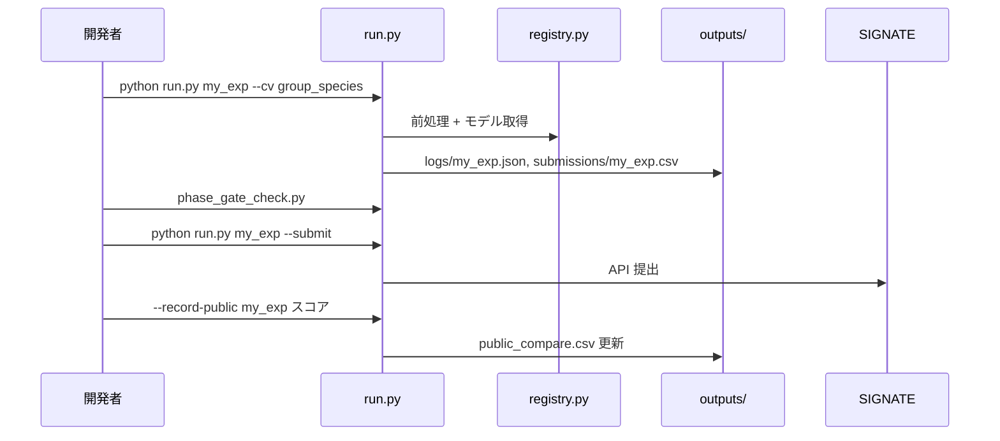

# チームオンボーディング

新メンバーが **30 分でキャッチアップ** できるためのガイドです。

---

## このコンペで何をしているか

- **入力**: 木材の近赤外スペクトル（1555 波長 + メタ列）
- **出力**: 含水率（%）の回帰
- **難所**: train と test で **樹種が完全に被らない**（ドメインシフト）
- **現状ベスト**: raw スペクトル + **単一波長線形回帰**（index 616 付近）→ Public **17.496**

複雑な PLS / SNV+diff1 / Group curve はローカル CV では良く見えても、Public では **17.5 を超えにくい** 実績があります。

---

## リポジトリ構成（詳細）

```
signate-nir-challenge/
│
├── run.py                          … エントリポイント
│
├── src/experiments/registry.py     … 実験カタログ（ここを見れば全体像）
│       例: candidate_linear_1f = spectral + single_feature_linear
│
├── src/pipeline/
│   ├── runner.py                     … run.py から呼ばれる実行エンジン
│   ├── data.py                       … CSV 読込（cp932）
│   ├── cv.py                         … CV 戦略
│   │     group_species    … 樹種でグループ分割（Public 相関が最も高い）
│   │     leave_one_species … 1 樹種除外（Public とはズレやすい）
│   │     moisture_quantile … 含水率分位で分割
│   ├── preprocessors/
│   │     spectral              … raw
│   │     spectral_snv_diff1    … SNV + 1 次微分
│   │     spectral_blend_snv25  … raw 75% + SNV 25%（Public 18.558）
│   │     …
│   ├── models/
│   │     single_feature_linear           … |corr| 最大の 1 波長で線形回帰
│   │     nearest_train_species_bias_corrected … test→最近傍 train の残差補正
│   │     …
│   ├── public_score.py             … Public 記録・比較・proxy
│   └── signate_submit.py           … API 提出
│
├── src/eda/                          … 分析専用（提出に使わない）
│   ├── inspect_data.py
│   ├── domain_shift_analysis.py
│   ├── analyze_test_predictions.py
│   └── …
│
├── scripts/
│   ├── setup_token.py
│   ├── download_competition_data.py
│   └── phase_gate_check.py         … 提出ゲート
│
├── data/raw/                         … train.csv, test.csv（各自 DL）
├── data/submissions/                 … 提出 CSV
├── outputs/logs/                     … 実験ログ JSON
├── outputs/leaderboard.csv           … ローカルランキング
├── outputs/public_compare.csv        … Public 実測一覧
└── docs/                             … 本ドキュメント群
```

---

## 実験のライフサイクル



---

## 用語集

| 用語 | 意味 |
|------|------|
| **1f** | `candidate_linear_1f` — Public ベスト（raw 単波長） |
| **public_diff** | 1f との提出 CSV の RMSE 差（0 に近い = ほぼ同じ予測） |
| **ゲート** | `phase_gate_check.py` — public_diff 0〜10 & moisture_cv 許容内 |
| **Private** | 最終評価用。SIGNATE で 2 枠選択 → **1f 必須** |
| **Public** | リーダーボード表示用。週 5 枠提出 |

---

## ローカル CV の信頼度（EDA 結果）

| CV 戦略 | Public との相関 | 使い方 |
|---------|----------------|--------|
| **group_species** | **+0.52** | **主指標** |
| moisture_quantile | 中 | 副指標・ゲート |
| leave_one_species | -0.06 | **信頼しない** |

---

## やってよいこと / やらないこと

### やってよい

- `registry.py` に実験追加 → ローカル CV → ゲート → 週 1 本提出
- EDA スクリプトの実行・拡張
- `docs/` への調査メモ追記

### やらない

- `config.py` のコミット
- snv_diff1 単体の再提出（Public ~25 確定）
- LOO だけ良いモデルの盲目的提出
- 1f と同一予測の再提出

---

## セットアップチェックリスト

- [ ] `git clone` 完了
- [ ] `.venv` + `pip install -r requirements.txt`
- [ ] `config.py` 作成 + `setup_token.py` 成功
- [ ] `data/raw/train.csv` 存在
- [ ] `python run.py candidate_linear_1f` 成功
- [ ] `docs/NEXT_ACTIONS.md` を読んだ

---

## 連絡・共有

- **コード変更**: feature ブランチ → PR（または main 直接でも可、チーム方針に従う）
- **Public スコア**: 提出者が `--record-public` → `public_compare.csv` を各自 pull 後に再生成
- **提出方針**: `python run.py --top5` → `outputs/daily_candidates.csv`
